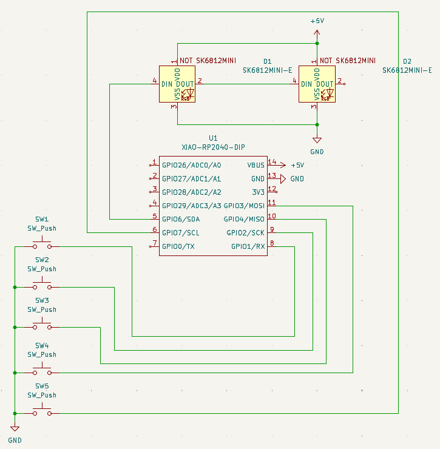
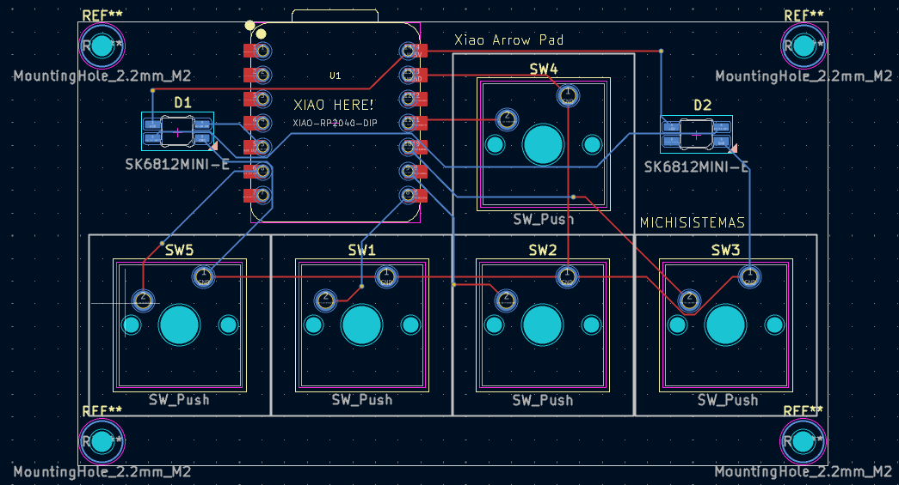
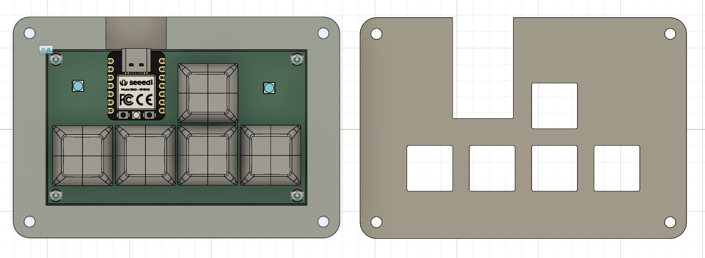

# Xiao Arrow Pad

A 5-key macropad designed in KiCad and Fusion 360 using a Seeed XIAO RP2040.

Why I made the Hackpad?
I really wanted to take on this challenge; I'd never done a hardware project before, so the idea really excited me. Although I've had to modify my project several times, I think it's been worth it, since I've learned a lot from my mistakes. I hope to continue challenging myself even more.

## Schematic

## PCB

## Case

## Firmware
This project uses KMK firmware.

## BOM

- 5x Cherry MX Switches
- 2x SK6812 MINI LEDs
- 1x Seeed XIAO RP2040 DIP
- 5x Blank DSA Keycaps
- 4x M3x8 Bolt
- 4x M2x5 Socket Head Cap Screw
- PCB (2 layers)
